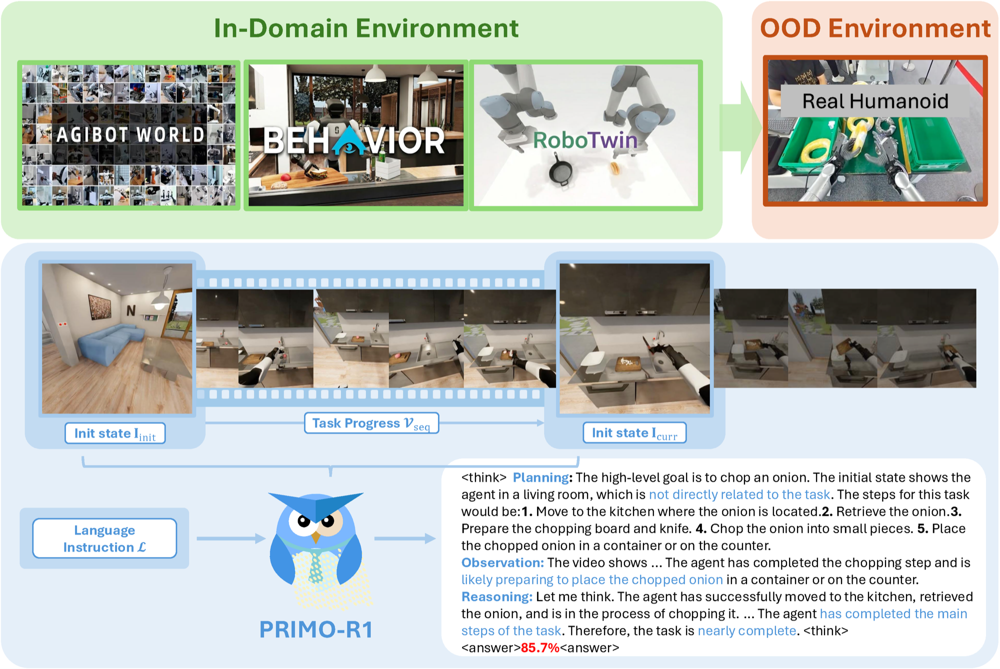
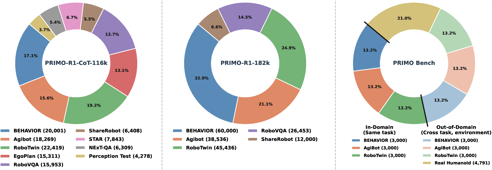

# PRIMO R1: From Passive Observer to Active Critic

**Reinforcement Learning Elicits Process Reasoning for Robotic Manipulation**

[[📖 Paper](https://arxiv.org/abs/2603.15600)] [[🌐 Project Page](https://10-oasis-01.github.io/primo-r1-website/)] [[🤗 Model/Dataset](https://huggingface.co/collections/LeonOverload/primo-r1)]

Yibin Liu, Yaxing Lyu, Daqi Gao, Zhixuan Liang, Weiliang Tang, Shilong Mu, Xiaokang Yang, Yao Mu

---

## About

<p align="center">
  
</p>

Accurate process supervision is a bottleneck for long-horizon robotic manipulation. Video MLLMs trained under a pure SFT paradigm behave as passive **Observers**: they recognise what is happening rather than judging the current state against the final goal.

PRIMO R1 (**P**rocess **R**easoning **I**nduced **MO**nitoring) is a 7B framework that turns a video MLLM into an active **Critic**. Two ideas carry the work:

1. **Outcome-based RL for explicit reasoning.** GRPO on a verifiable progress reward incentivises chain-of-thought generation for progress estimation, instead of imitating CoT token-by-token.
2. **Structured temporal input.** The video sequence is anchored between an initial-state and a current-state image — the *interleaved* format `I_init + V_seq + I_curr` — rather than fed as a bare clip.

Training is two staged: an SFT cold start, then GRPO RL on top of that checkpoint.

Quantitative results are in the [paper](https://arxiv.org/abs/2603.15600) and on the [project page](https://10-oasis-01.github.io/primo-r1-website/).

## Models and data

Everything is released on Hugging Face, collected under [🤗 PRIMO R1](https://huggingface.co/collections/LeonOverload/primo-r1). Each repo's card is self-contained; the sizes below are what you actually download.

| Repo | What it is | Size |
| --- | --- | --- |
| [PRIMO-R1-7B](https://huggingface.co/LeonOverload/PRIMO-R1-7B) | final SFT+RL checkpoint — use this one | 16.6 GB |
| [PRIMO-COT-SFT-7B](https://huggingface.co/LeonOverload/PRIMO-COT-SFT-7B) | stage-1 cold start; the SFT-only ablation, and the RL starting point | 16.6 GB |
| [primo-bench-json](https://huggingface.co/datasets/LeonOverload/primo-bench-json) | benchmark annotations, 7 splits / 23,704 samples | 71 MB |
| [primo-sft-json](https://huggingface.co/datasets/LeonOverload/primo-sft-json) | stage-1 CoT annotations, 10 subsets / 116,755 records | 856 MB |
| [primo-rl-json](https://huggingface.co/datasets/LeonOverload/primo-rl-json) | stage-2 RL annotations, 6 subsets / 328,454 records | 1.7 GB |
| [primo-video-media](https://huggingface.co/datasets/LeonOverload/primo-video-media) | videos + pre-extracted anchor frames, multipart zip | **6.58 TB** |

<p align="center">
  
</p>

<p align="center"><em>Dataset distribution for SFT (left), RL (middle), and PRIMO Bench (right).</em></p>

The RL panel shows the 182k mixture the paper trained on; `primo-rl-json` ships 328,454 records because it releases all available `behavior-1k` annotations (206,029) rather than the 60,000 sampled for training. Every other RL subset matches the figure exactly.

**The annotations are small; the videos are not, and they are extremely skewed.** `behavior-1k` alone is 5,981 GB — 91% of the media release. Skip it unless you specifically need the long-horizon progress-estimation results. `robotwin` is 12.5 GB and covers both benchmark robotwin splits plus both robotwin training subsets, so it is the cheapest way to get a working run.

A minimal end-to-end setup — the model plus one benchmark environment, roughly 29 GB of download:

```bash
export VIDEO_DATA_ROOT=/path/to/PRIMO-Data
export MODEL_ROOT=/path/to/models

# Model
hf download LeonOverload/PRIMO-R1-7B --local-dir "$MODEL_ROOT/PRIMO-R1-7B"

# Benchmark annotations -> $VIDEO_DATA_ROOT/primo-bench/
hf download LeonOverload/primo-bench-json --repo-type dataset \
    --include "raw_json/*" --local-dir /tmp/primo-bench
cp -r /tmp/primo-bench/raw_json/primo-bench "$VIDEO_DATA_ROOT/"

# Videos for the robotwin splits -> $VIDEO_DATA_ROOT/primo-video/
hf download LeonOverload/primo-video-media --repo-type dataset \
    --include "robotwin.z*" --local-dir /tmp/primo-video-zips
7z x /tmp/primo-video-zips/robotwin.zip -o"$VIDEO_DATA_ROOT/primo-video/"

bash src/eval/src/eval_interleave_local.sh
```

Training data follows the same shape — see the [SFT](https://huggingface.co/datasets/LeonOverload/primo-sft-json) and [RL](https://huggingface.co/datasets/LeonOverload/primo-rl-json) cards for the per-subset download commands and the `SFT_DATASET` / `RL_DATASET` mixtures that drop `behavior-1k`.

`PRIMO-R1-7B`'s DeepSpeed resume state from RL step 2500 lives on a separate `training-state` branch, so a default download is 16.6 GB rather than ~116 GB:

```python
from huggingface_hub import snapshot_download

snapshot_download("LeonOverload/PRIMO-R1-7B", local_dir="models/PRIMO-R1-7B")   # inference
snapshot_download("LeonOverload/PRIMO-R1-7B", revision="training-state")        # resume RL
```

Note that `hf download`'s `--include` / `--exclude` are silently ignored if you also pass filenames positionally.

## Install

Requires Linux with CUDA GPUs. Local macOS work is limited to reading and editing code.

```bash
conda create -n primo-r1 python=3.11 && conda activate primo-r1
cd PRIMO-R1
bash setup.sh
```

`setup.sh` installs, in this order:

1. `src/r1-v` editable, which pulls in `torch`, `vllm==0.7.2`, `trl==0.16.0`, DeepSpeed and the eval dependencies.
2. `tensorboardx` and `flash-attn` (the latter with `--no-build-isolation`, since it needs an existing torch).
3. The vendored `src/qwen-vl-utils` editable with the `decord` extra — **after** step 1, so this local copy shadows any `qwen_vl_utils` a transitive dependency pulled from PyPI.
4. The vendored `transformers-main/` tree — **last**, so nothing replaces it.

The pins are not cosmetic. Qwen2.5-VL support shifts between transformers releases, and installing a PyPI `transformers` over the vendored tree is the usual cause of shape and processor errors. `vllm==0.7.2` and `trl==0.16.0` are likewise pinned by upstream R1-V. `transformers` is deliberately absent from `setup.py`'s dependency lists so pip cannot silently replace the vendored install.

Verify:

```bash
python -c "import transformers, trl, vllm, qwen_vl_utils; print(transformers.__version__, trl.__version__, vllm.__version__)"
```

## Data layout

The published repos are packaged to drop straight into this tree — annotations go to `$VIDEO_DATA_ROOT/`, archives extract to `$VIDEO_DATA_ROOT/primo-video/`:

```
$VIDEO_DATA_ROOT/
├── primo-bench/<source>/{id,ood}.json       <- primo-bench-json  raw_json/
├── primo-sft/<source>/train_cot.json        <- primo-sft-json    raw_json/
├── primo-rl/<source>/train.json             <- primo-rl-json     raw_json/
└── primo-video/<group>/{videos,frames}/     <- primo-video-media archives
```

`raw_json/` is what the entry points read. The `jsonl/` shards in the same repos exist only to drive the Dataset Viewer, so `load_dataset(...)` is for browsing, not for training.

Two environment variables locate everything:

| Variable | Meaning | Default |
| --- | --- | --- |
| `VIDEO_DATA_ROOT` | root of the PRIMO data tree | `PRIMO-R1/data` |
| `MODEL_ROOT` | checkpoint directory | `PRIMO-R1/models` |

`src/r1-v/src/open_r1/DatasetLoader.py` is the **single dataset registry**. It maps a logical name to a JSON manifest plus a video root under `VIDEO_DATA_ROOT` and returns `(json_list, video_paths)`. Add new datasets to its `cfg` dict rather than threading raw paths through scripts.

23 registered datasets, named `primo-{sft,rl,bench}-<source>`:

- **SFT (10)**: `agibot`, `behavior-1k`, `robovqa`, `robotwin-clean`, `robotwin-randomized`, `nextqa`, `perceptiontest`, `seed-bench-r1`, `star`, `sharerobot`
- **RL (6)**: `agibot`, `behavior-1k`, `robovqa`, `robotwin-clean`, `robotwin-randomized`, `sharerobot`
- **Bench (7)**: `primo-bench-{id,ood}-agibot`, `primo-bench-{id,ood}-behavior-1k`, `primo-bench-{id,ood}-robotwin`, `primo-bench-ood-real-humanoid`

A `-cot` suffix selects the CoT variant; SFT datasets force CoT filtering (`select == true` plus the four required fields `process`, `planning`, `observation`, `reasoning`).

The interleaved input format needs a first and last frame per video. **The published archives already ship them**, and the published JSON already carries `init_frame_path` / `current_frame_path`, so there is no preprocessing step for the released data. For datasets you add yourself:

```bash
python src/preprocess_video_frames.py                       # all 23 datasets
python src/preprocess_video_frames.py --only-behavior       # one subset
```

This writes `<VIDEO_DATA_ROOT>/primo-video/<source>/frames/` and adds `init_frame_path` / `current_frame_path` to each JSON record in place, backing up the original to `.json.backup`. Records whose extraction fails are left untouched rather than dropped.

Training reads those two fields from the JSON; evaluation ignores them and re-derives both frames with OpenCV at run time.

## Training

Two stages, six launchers. Paths come from the environment; GPU count is
auto-detected.

```bash
# Stage 1: SFT cold start
bash src/scripts/run_sft_7b.sh

# Stage 2: GRPO RL on top of the stage-1 checkpoint
export SFT_CKPT=/path/to/primo-sft-7b/checkpoint-XXXX
bash src/scripts/run_rl_7b.sh
```

3B variants (`run_sft_3b.sh`, `run_rl_3b.sh`) and the video-only baselines
(`run_sft_baseline_7b.sh`, `run_rl_baseline_7b.sh`) are alongside them. To skip
stage 1, point `SFT_CKPT` at the published cold start
`LeonOverload/PRIMO-COT-SFT-7B`.

Hyper-parameters, the full override list, and the R1-V invariants are in
[`src/scripts/README.md`](src/scripts/README.md).

## Evaluation

Four launchers, run from the project root.

```bash
bash src/eval/src/eval_baseline_local.sh     # local baselines, vLLM  -> eval_outputs/baseline/
bash src/eval/src/eval_interleave_local.sh   # PRIMO R1 models        -> eval_outputs/interleave/
bash src/eval/src/eval_ablation.sh           # input-modality sweep   -> eval_outputs/ablation/
bash src/eval/src/eval_api.sh                # remote API models      -> eval_outputs/api/
```

Results land in `src/r1-v/eval_outputs/<kind>/<model_name>/<dataset>.json`. Models
and datasets are selected by a comment-toggled heredoc inside each launcher, not
by CLI flags.

Metric definitions — including the three non-comparable `regression` formulas —
and per-harness setup are in [`src/eval/README.md`](src/eval/README.md).

## Shared modules

`src/primo_prompts.py` and `src/primo_video_utils.py` are the single source of
truth for every prompt and for the anchor-frame helpers. Import from them rather
than pasting a copy. The answer extractors are coupled to the prompt format, so
editing a prompt without updating them silently collapses scores rather than
erroring — see [`src/README.md`](src/README.md).

## Single example

```bash
python ./src/inference_example.py
```

## Lint

`src/r1-v` carries the upstream open-r1 tooling. There is no test suite.

```bash
cd src/r1-v
make style      # black --line-length 119 + isort
make quality    # check-only + flake8
```

## Citation

```bibtex
@misc{liu2026passiveobserveractivecritic,
      title={From Passive Observer to Active Critic: Reinforcement Learning Elicits Process Reasoning for Robotic Manipulation},
      author={Yibin Liu and Yaxing Lyu and Daqi Gao and Zhixuan Liang and Weiliang Tang and Shilong Mu and Xiaokang Yang and Yao Mu},
      year={2026},
      eprint={2603.15600},
      archivePrefix={arXiv},
      primaryClass={cs.RO},
      url={https://arxiv.org/abs/2603.15600},
}
```

## Acknowledgement

Built on [Video-R1](https://github.com/tulerfeng/Video-R1), which is itself built on [R1-V](https://github.com/Deep-Agent/R1-V) and [open-r1](https://github.com/huggingface/open-r1). Thanks to those authors for releasing their code.
